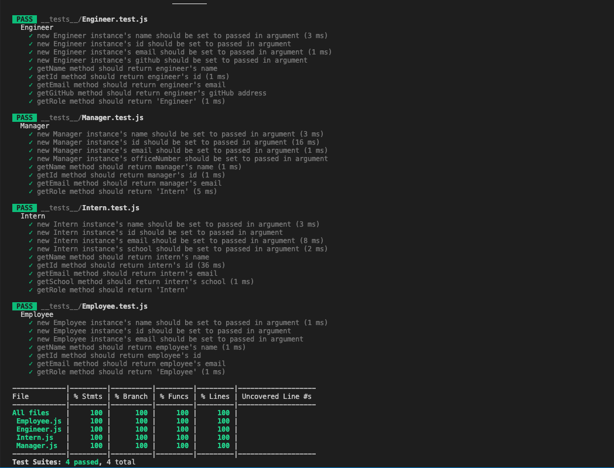
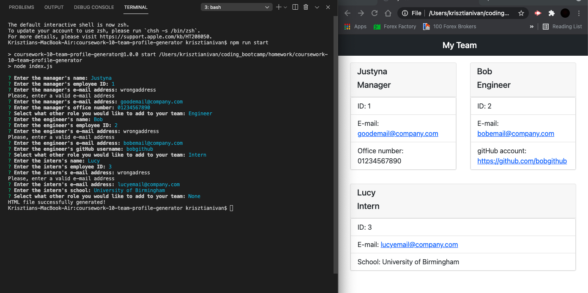

# Team Profile Generator

## Description

In this project I have created an organisational chart generator that allows the user to add a manager and multiple engineers and interns to the team using the command line. When all team members are added the application generates a styled index.html file with the team profile.

## Installation

```
git clone https://github.com/ivnkris/team-profile-generator.git
cd team-profile-generator
npm install
node index.js
```

## Contributing

Submit a pull request

## Tests

Run `npm test` to see the attached tests

## Scripts

```
npm start
npm test
npm test:watch
```

## Link to GitHub repository

https://github.com/ivnkris/team-profile-generator

## Link to walkthrough video

https://drive.google.com/file/d/1l9QyGaMBbnlKo4h8c_O7j6vRu3Dmo3NK/view

## Screenshots




## Questions

- Send any questions via my [GitHub profile](https://github.com/ivnkris)
